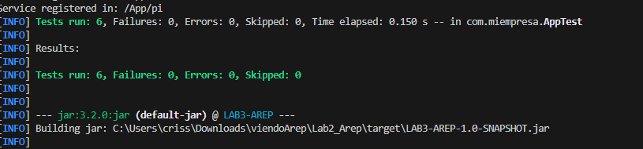
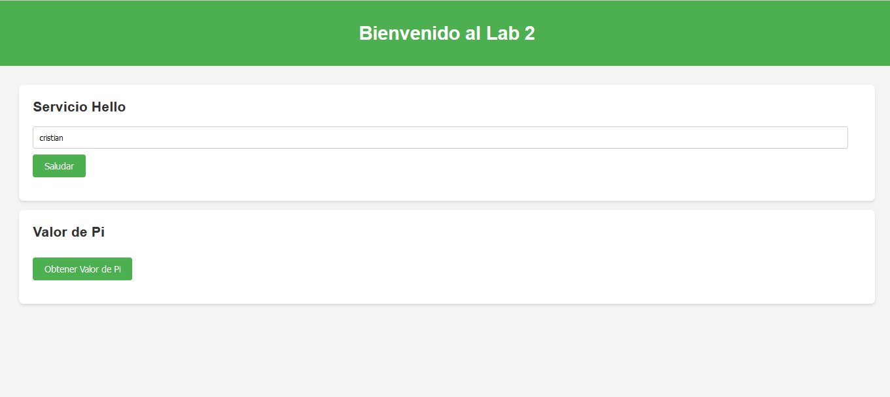
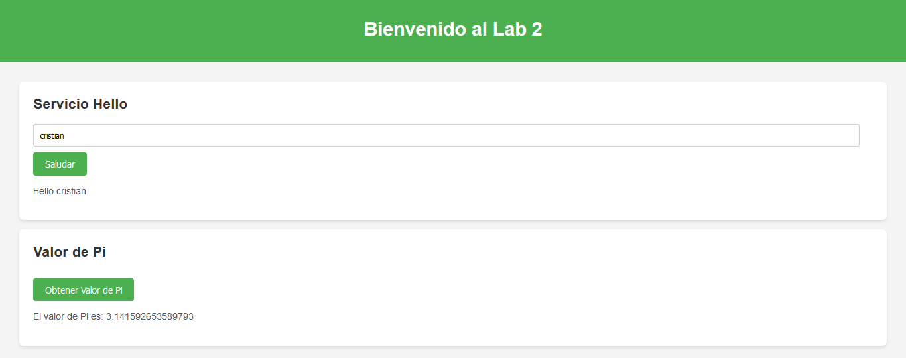

# Web Framework Development for REST Services and Static File Management

## Description

This project implements a web framework that enhances a basic web server to handle both RESTful services and static file hosting. Developers can define REST services using lambda expressions, easily retrieve query parameters from client requests, and set the directory for serving static files. This setup enables the seamless development and deployment of web applications with a mix of dynamic and static content.

## Instructions to Run

1. **Clone the Repository**:
   ```bash
   git clone https://github.com/bricenojuliana/AREP-lab2-Microframeworks-WEB.git
   cd AREP-lab2-Microframeworks-WEB
   ```

2. **Build the Project**:
   installed and run:
   ```bash
   mvn clean install
   ```

3. **Run the Application**:
   Execute the main class :
   ```bash
   java -cp target/LAB3-AREP-1.0-SNAPSHOT.jar com.miempresa.App
   ```

4. **Access the Web Application**:
   - Static Files: `http://localhost:8080/index.html
   - REST Services: `http://localhost:8080/App/hello?name=YourName`


### Components

1. **App Class**:
   - Purpose: Manages the registration of REST services and specifies the directory for static files.
   - Methods:
     - `get(String url, Service s)`: Registers a REST service.
     - `staticfiles(String location)`: Specifies the directory for static files.

2. **SimpleWebServer Class**:
   - Purpose: Manages incoming HTTP requests, directing them to the appropriate service or serving static files..
   - Methods:
     - `initializeServer()`:  Starts the server and listens for incoming connections.
     - `handleClientRequest(Socket client)`:  Processes HTTP requests from clients and routes them accordingly.


3. **Request Class**:
   - Purpose: Extracts and manages query parameters from client requests.
   - Methods:
     - `setResponseBody(String body)`:  Sets the content of the response body.

4. **Response Class**:
   - Purpose: Constructs and manages the response that will be sent back to the client.
   - Methods:
     - `setBody(String body)`: Sets the response body.
     - `getBody()`: Retrieves the response body.
  
  
## Architecture

### Project Tree
```
.
+---src
|   +---main
|   |   \---java
|   |       \---com
|   |           \---miempresa
|   |                   App.java
|   |                   Request.java
|   |                   Response.java
|   |                   Service.java
|   |                   SimpleWebServer.java
|   |
|   +---resources
|   |       app.js
|   |       index.html
|   |       styles.css
|   |
|   \---test
|       \---java
|           \---com
|               \---miempresa
|                       AppTest.java

```


## Tests

-Runing Tests



-deploiment test







   
